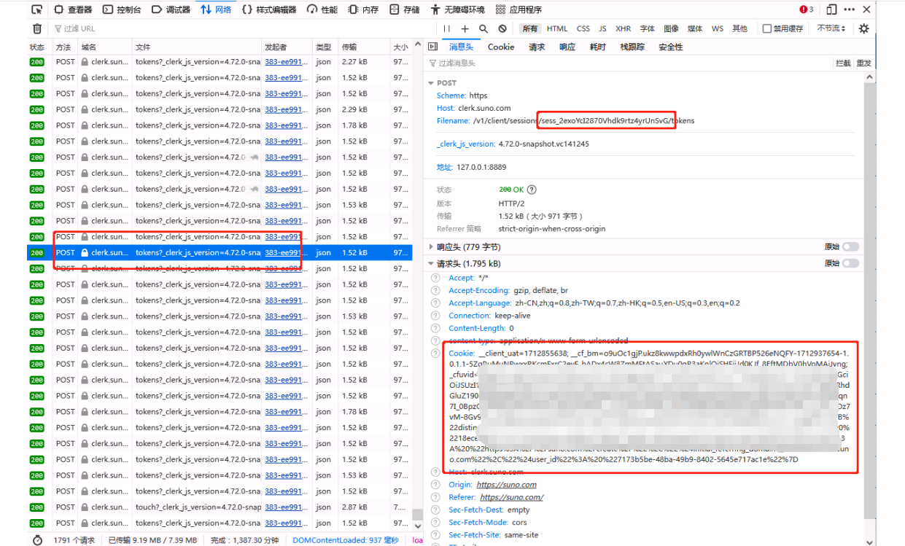
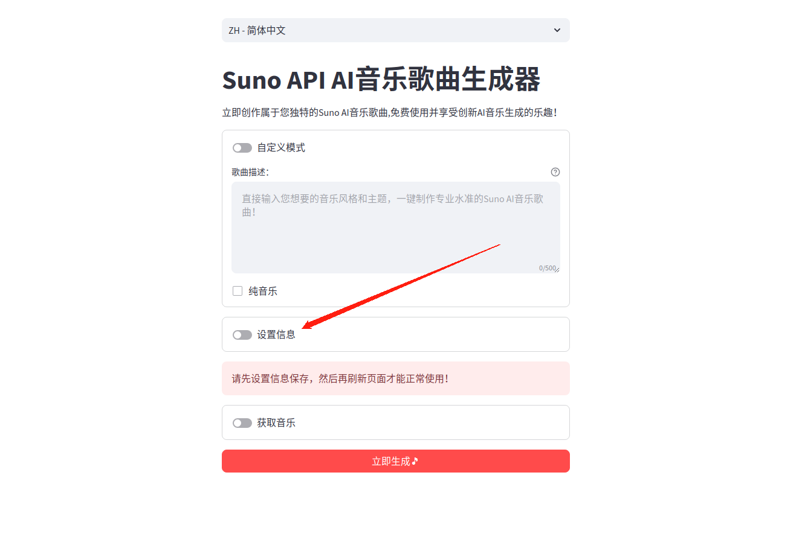
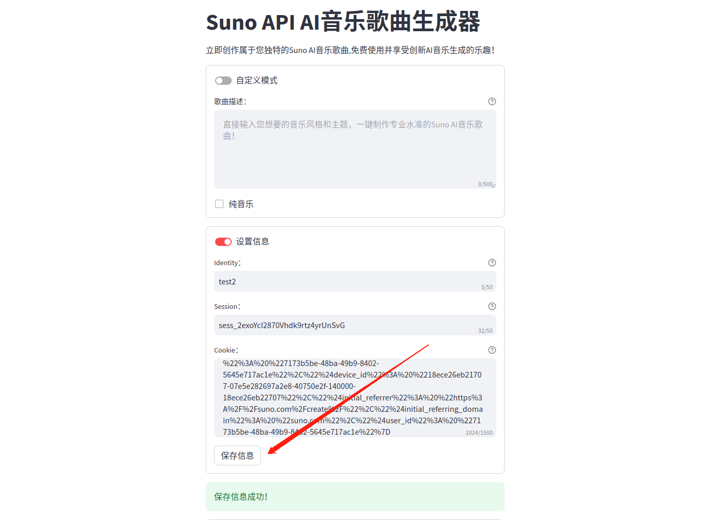
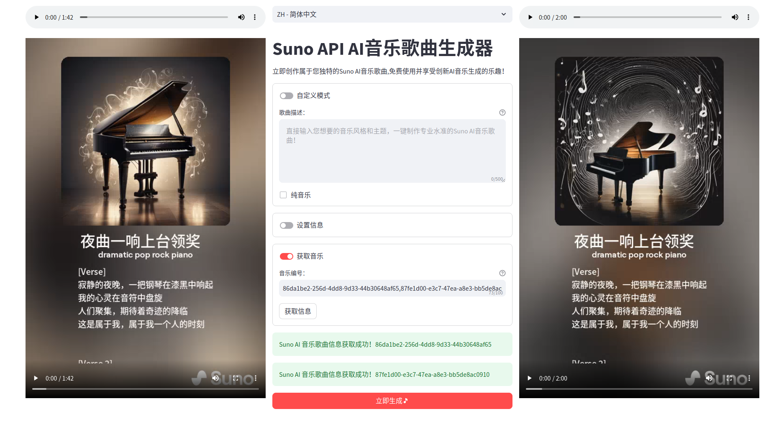

[繁體中文](README_TC.md) | [English](README.md) | [한국어](README_KR.md) | [日本語](README_JP.md)

# Suno API 非官方 Suno AI 客户端

这是一个基于 Python、Streamlit 的非官方 Suno API 客户端，目前支持生成音乐，获取音乐信息等功能。  
自带维护 token 与保活功能，无需担心 token 过期问题，可以设置多个账号的信息保存以便使用。

### 特点

- token 自动维护与保活
- 可以设置多个账号的信息保存使用
- 代码简单，易于维护，方便二次开发

### 使用

#### 运行

安装依赖

```bash
pip3 install -r requirements.txt
```

启动项目，关于Streamlit请自行参考Streamlit文档

```bash
streamlit run main.py
```

#### Docker

```bash
docker compose build && docker compose up
```


#### 配置

先从浏览器页面登录状态下中获取自己的session和cookie。



填写设置信息里面后面会自动保活，可以填写多个账号信息。



填写后保存信息，输入identity可以更改修改账号信息。



#### 完成

启动运行项目后浏览器访问 http://localhost:8501/ 即可使用了。




#### 问题

- 如果页面一直提示：请先设置信息保存，然后再刷新页面才能正常使用！请先添加自己的账号信息保存，然后把sunoapi.db数据库里面其他无效的账号信息删除，其中包括我测试的账号信息，然后再就可以正常使用了。
- 音乐生成任务提交成功后拉取生成任务队列状态，当状态为"complete"时成功返回，这个时候默认停留了15秒等待官方生成文件。官方接口服务直接返回了媒体文件Url地址，大部分时候页面能正常显示这些媒体文件。偶尔有时候接口已经返回了媒体文件Url地址，但是实际文件还不能从Url地址访问到要等一会。这个时候媒体文件在页面就可能无法加载到，可以点下媒体播放器鼠标右键复制媒体文件地址，用浏览器单独打开这个地址就可以访问到了或者直接右键另存为下载保存。
- 关于设置账号session和cookie信息保存安全性问题，只要你的账号不充值就没必要担心，因为不知道你的账号密码，你填写的session和cookie信息只要你的账号在其他地方登录活动，或者在官方网站退出登录，那么填写的session和cookie就无效了，并且下次登录官网session和cookie都会发生变化的。


#### 交流


## 参考

- Suno.com 官网: [https://suno.com](https://suno.com)
- Suno-API: [https://github.com/SunoAI-API/Suno-API](https://github.com/SunoAI-API/Suno-API)


## 声明

SunoApi 是一个非官方的开源项目，仅供学习和研究使用。用户自愿输入免费的账号信息生成音乐。每个帐户每天可以免费生成五首歌曲，我们不会将它们用于其他目的。请放心使用！如果有10000名用户，那么系统每天可以免费生成50000首歌曲。请尽量节省使用量，因为每个帐户每天只能免费生成五首歌曲。如果每个人每天创作五首以上的歌曲，这仍然不够。最终目标是让在需要的时候能随时免费生成。
